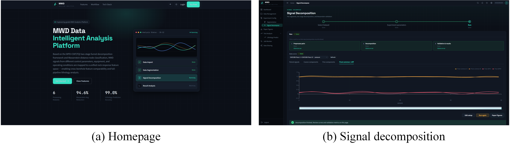

# MWD Signal Decomposition: Two-Level Funnel Framework

Companion code and data for the paper:

> **Feature-consistent mapping of MWD data under inconsistent borehole conditions: improving data utilization and correlation analysis**  
> Jingqi Cui, Shunchuan Wu, Keqing Li, Chaoqun Chu  
> *[Journal name, Year]* · DOI: [pending]

## Overview

Measurement-while-drilling (MWD) signals are jointly modulated by rock properties and borehole state (device configuration, control mode, and drilling parameters). This makes cross-condition comparison and model transfer difficult. This repository provides the implementation of a **two-level funnel decomposition framework** that separates MWD signals into:

- **Common Component (CC)**: parameter-insensitive part, converges across boreholes of the same lithology
- **Differential Component (DiC)**: parameter-specific part, diverges across boreholes

The decomposition enables cross-state feature alignment without requiring labeled rock data.

### Method Overview


## Web Platform

An interactive browser-based platform is available at **[mwd.drcui.top](https://mwd.drcui.top/)** for MWD signal analysis, decomposition visualization, and lithology prediction without writing code.



Key features:

- Upload borehole `.xlsx` files and run the two-level decomposition interactively
- Visualize CC / DiC separation per signal and per borehole pair
- Inspect amplitude retention rates and cross-hole coherence metrics
- Run lithology classification and view per-group prediction results

## Repository Structure

```
MWD_Signal_decomposition/
├── figs/
│   ├── Overall method process.png
│   └── WEB.png
├── algorithm/
│   ├── config.py               # All parameters (input path, decomposition settings)
│   ├── step0_preprocess.py     # Signal segmentation and pair preparation
│   ├── step1_line1.py          # Two-level decomposition (WPD + CWT-FQI)
│   └── main.py                 # Entry point: runs step0 → step1
│
├── lithology_prediction/
│   └── predict_lithology_5types.py   # 5-class lithology classification (6 classifiers)
│
└── data/
    ├── SandstoneA/             # TRD device (4 holes) + RCT device (1 hole), N=30 holes
    │   └── curve_features_per_signal.csv
    ├── SandstoneB/             # RCT Sandstone B, N=6 holes
    │   └── curve_features_per_signal.csv
    ├── SandstoneC/             # RCT Sandstone C, N=11 holes
    │   └── curve_features_per_signal.csv
    ├── Granite/                # TRD Granite, N=15 holes
    │   └── curve_features_per_signal.csv
    └── Limestone/              # TRD Limestone, N=11 holes
        └── curve_features_per_signal.csv
```

## Data Description

Each `curve_features_per_signal.csv` contains per-signal statistical features extracted from decomposed MWD signals. No raw waveforms are included. Key columns:

| Column | Description |
|--------|-------------|
| `signal` | Signal type: `pressure` (MPa) or `torque` (N·m) |
| `stage` | Decomposition stage: `original` (raw signal) or `final_comm` (CC) |
| `pair` | Borehole pair identifier (e.g., `Case-1 vs Case-2`) |
| `hole` | Borehole ID within the pair |
| `mean`, `rms`, `std`, ... | Amplitude-domain features |
| `dominant_freq`, `spectral_entropy`, ... | Frequency-domain features |
| `sample_entropy` | Complexity feature |

The pairwise pairing strategy expands the usable sample count from 73 original holes to **1,330 CC samples** (N×(N−1)/2×2 per group).

## Requirements

```
numpy >= 1.21
pandas >= 1.3
scipy >= 1.7
PyWavelets >= 1.1
scikit-learn >= 1.0
xgboost >= 1.6
lightgbm >= 3.3
openpyxl >= 3.0      # for reading .xlsx input files
```

Install with:
```bash
pip install numpy pandas scipy PyWavelets scikit-learn xgboost lightgbm openpyxl
```

## Running the Decomposition

1. Set `INPUT_FOLDER` in `algorithm/config.py` to point to your data directory (folder of `.xlsx` files, one per borehole).
2. Each `.xlsx` file should contain MWD time series with columns including `pressure` and `torque`.
3. Run:

```bash
cd algorithm
python main.py
```

Output is written to a folder named `<data_folder>_output/` alongside the data.

## Running Lithology Classification

The feature CSVs in `data/` can be used directly to reproduce the classification results in Table 9 of the paper:

```bash
cd lithology_prediction
python predict_lithology_5types.py
```

This evaluates LDA, KNN, SVM-RBF, XGBoost, LightGBM, and RandomForest on `original` vs. `final_comm` features across the five lithology groups, using stratified 80/20 splits with 5-fold CV repeated 10 times.

**Expected results** (pressure + torque, best classifiers; mean accuracy averaged over 10 random 80/20 splits):
- Original signal → RandomForest: **94.7%**
- Common component → LightGBM: **99.0%**

## Key Configuration Parameters

In `algorithm/config.py`:

| Parameter | Default | Description |
|-----------|---------|-------------|
| `INPUT_MODE` | `"mixed"` | `"folder"` / `"excel"` / `"mixed"` |
| `MIXED_MAX_SEG_LEN` | `400` | Max segment length (samples); longer segments are split |
| `WPD_WAVELET` | `"db4"` | Wavelet basis for WPD |
| `OTSU_MODE` | `"global"` | Otsu threshold applied globally or per-pair |
| `SIGMOID_K` | `1.0` | Sigmoid slope (soft-mask sharpness) |
| `COMM_BASELINE` | `True` | Subtract signal baseline before decomposition |

## Citation

If you use this code or data, please cite:

```bibtex
@article{cui2026mwd,
  title   = {Feature-consistent mapping of MWD data under inconsistent borehole conditions},
  author  = {Cui, Jingqi and Wu, Shunchuan and Li, Keqing and Chu, Chaoqun},
  journal = {[Journal name]},
  year    = {2026},
  doi     = {[pending]}
}
```

## License

This project is licensed under the [Apache License 2.0](LICENSE).  
When using the data, please cite the paper.
